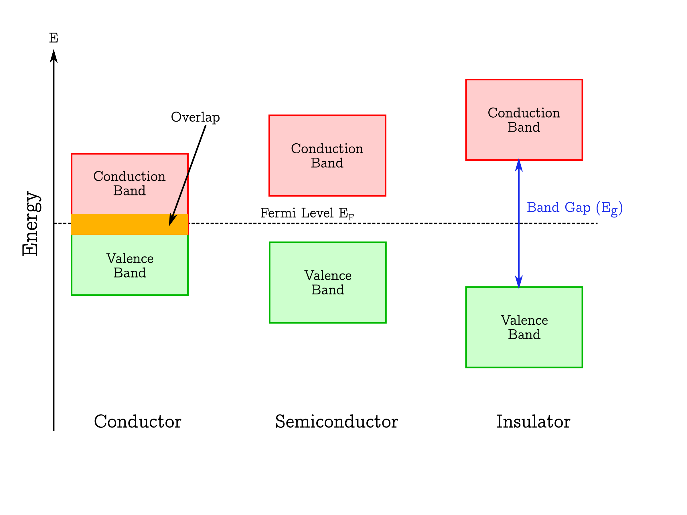
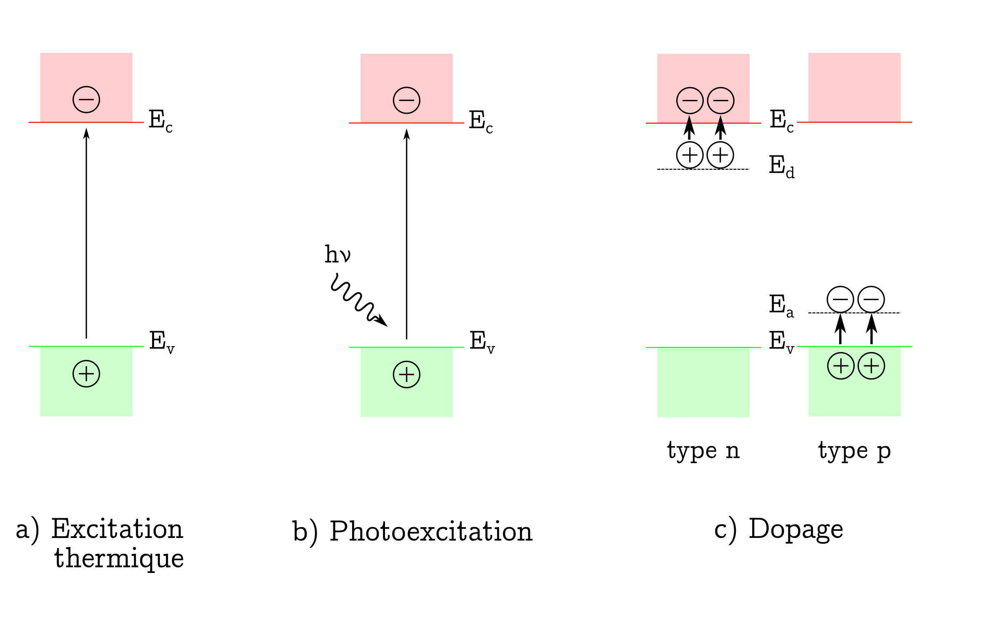

PEC
====

Introduction
------------

PEC takes advantage of the photovoltaic effect, discovered by :cite:p:`becquerel1839` in 1839,
that occurs at the interface of a semiconductor and an electrolyte. In fact, the first experience showed
the occurence of a photopotential and a photocurrent under illumination when a silver electrode, covered with an
oxide layer, was immersed in an acidic medium and connected to a platinum electrode.
Nonetheless, the first studies focused on the understanding of the interfacial processes were performed
much later :cite:p:`Stimming1986,gerischer1966,copeland1942`.

The basics of photoelectrochemistry and application examples are presented here and they are largely 
described in the literature :cite:p:`Morrison1980,gerischer1985,Memming2008,marcus2006,bard2002,sato1998`.
Several hypotheses are needed in order to apply the theoretical concepts:

* semiconductors are considered to be ideal i.e. crystalized and homogeneous
* the dielectric constant of the semiconductor is independent of the light wavelength
* the capacity of the Helmholtz layer is greater than the capacity of the space charge capacitance
* the potential drop in the Helmholtz layer is independent of the applied potential and is negligible

The hypotheses are rarely fully respected in the case of oxides or passive films formed on common alloys.
Nonetheless, the literature shows that the developed models can be applied to non-ideal systems
such as oxides or passive layers.

Solids are generally classified into three groups: *condcutors*, *semiconductors* and *insulators*.
Each category can be illustrated with a specific band structure as shown in figure :numref:`fig_band_structure`
:cite:p:`marucco2006`.
Valence and conduction bands correspond to the allowed energy states for the electrons.
The lowest energy level of the conduction band is labeled :math:`E_c` and the highest energy level 
of the valence is labeled :math:`E_v`. They are separated by a band gap, :math:`E_g`, with no allowed
energy states.
The repartition of the electrons among both bands are described by the position of the Fermi level, :math:`E_F`,
which represents the highest energy state that can be occupied at 0K.

.. _fig_band_structure:

    Band Structure

The electronic conduction is due to the movement either of the negatively charge electrons
in the conduction band or the positively charged holes in the valence band or both simultaneously.
Consequently, the conduction depends on the number of available charge carriers in the conduction and valence bands.
In conductors, an overlap of the conduction and the valence bands occurs which means that the highest
allowed energy band is partilly filled.
The distinction between a semiconductor and an isolator is less obvious because the conduction depends on the band
gap and the energy provided by the environment to the electron from the valence band in order to jump into
the conduction band.

In semiconductors, charge carriers can be generated by three mechanisms: *thermal*, *excitation*, *photoexcitation*,
*doping*, as shown in figure :numref:`fig_charge_generation`.

.. _fig_charge_generation:

    Band Structure