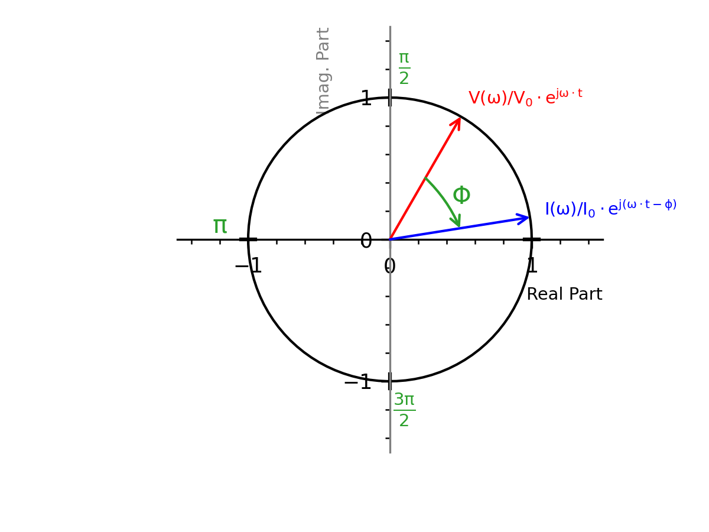
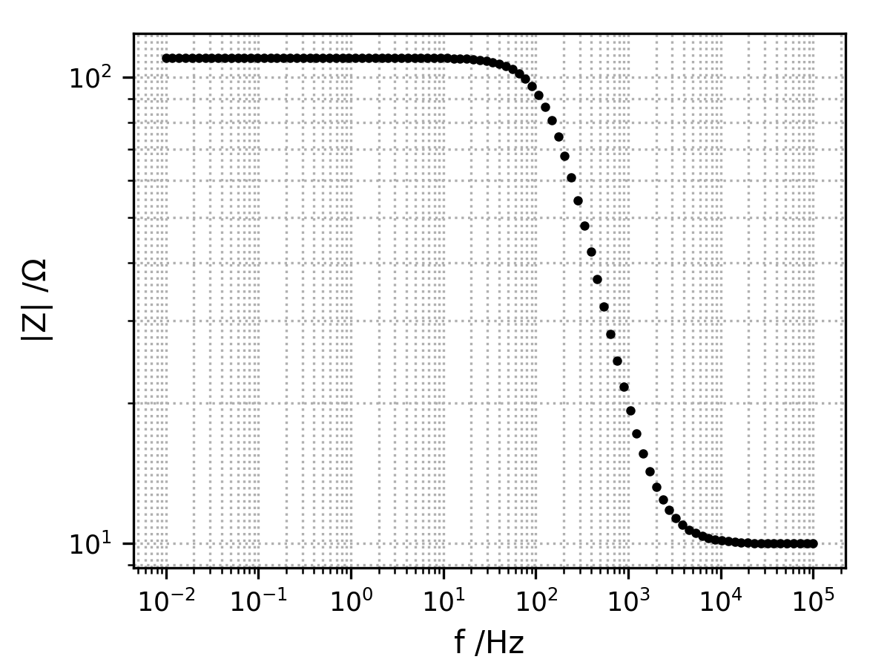
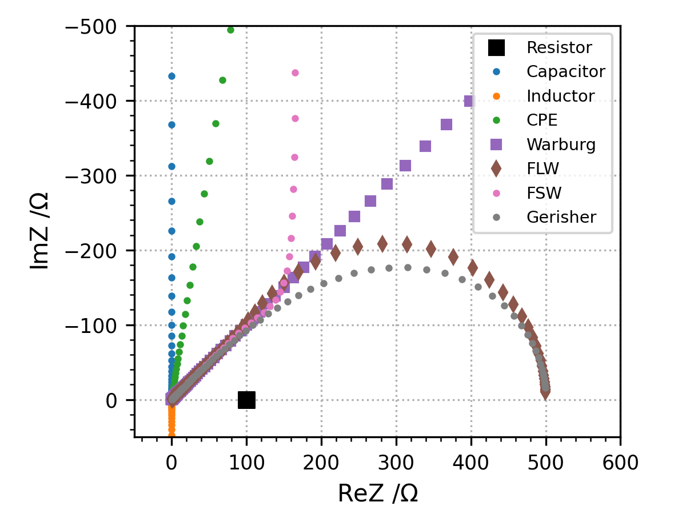

EIS
========

Introduction
------------
Frequency dispersion measurements (or impedance spectroscopy) have become a common technique for the study of mass
and charge transport in electrochemical systems. With the availability of automated high quality frequency response
analysis systems immittance (i.e. impedance or admittance) measurements can be obtained in fairly easy way 
:cite:p:`Barsoukov2005`.

The advantage of measurements taken in the frequency domain over measurements in the time domain
(i.e. pulse or step response measurements) is that the frequency response earl be described analytically,
using an equivalent circuit as model. Time domain analysis often requires the approximation of complex
functions, e.g. infinite summations of exponential functions. The circuit elements represent the various
(macroscopic) processes involved in the transport of charge and mass. The dispersion relations for most
equivalent circuit elements are very simple :cite:t:`Barsoukov2005,Orazem2008`.

If the (complex) immittance diagrams show distinct features, which can easily be related to specific subcircuits
of the equivalent circuit model, analysis become quite simple. Often this can be accomplished by graphical means,
using a compass and a ruler. However, if the time constants of the respective subcircuits are close together, or
if elements with a fractional (e.g. Warburg, or a CPE-type element, a more sophisticated analysis procedure is needed.
As the variation of one circuit parameter can influence large parts of the frequency dispersion, all
parameters must be adjusted simultaneously in order to obtain the optimum fit to the data 
:cite:p:`Boukamp1986,Bevington2003,Press2007`

Black Box Approach
-----------------------

* Assume a black box with two terminals.
* One applies a voltage and measures the current response (or visa versa) as show in :numref:`fig_ac_waves`
* Signal can be dc or periodic with frequency math:`f`, or angular frequency :math:`\omega=2 \pi f` 
  as shown in :numref:`fig_trig_circle` 
  
with: :math:`0 \leq \omega < \infty`:
  * Voltage: :math:`V(\omega) = V_0 \cdot e^{j \omega t}`
  * Current: :math:`I(\omega) = I_0 \cdot e^{j (\omega t - \phi)}`

.. _fig_ac_waves:
.. figure:: ../media/EIS-Principle-AC_waves.png
    :width: 600
    :alt: EIS AC Waves

    EIS AC Waves

.. _fig_trig_circle:

    Trigonometric Circle

What is EIS?
-----------------

The impedance is determined from the imposed voltage/current and the measured current/voltage through the Ohm's law:

.. math::

    Z(\omega) = \frac{V(\omega)}{I(\omega)} = \frac{V_0}{I_0} e^{j\phi} = Z_0 e^{j\phi}

Therefore:
* Resistive behavior: :math:`ReZ = Z_0 \cdot \cos \phi`
* Capacitive/Inductive behavior :math:`ImZ = Z_0 \cdot \sin \phi`

Sometimes, the complex admittance can also be used which is defined as the inverse of the complex impedance 

.. math::

    Y(\omega)=\frac{1}{Z(\omega)}

Representation
------------------

The impedance :math:`Z(\omega)` can be represented in two different ways as shown in: 

1. **Bode plot**: shows the phase shift and magnitude changes in the applied frequency ranges
   as shown in :numref:`fig_representation_mod` and :numref:`fig_representation_phase`
2. **Nyquist plot**: represents the real and imaginary parts of :math:`Z(\omega)` using cartesian coordinates
   as shown in :numref:`fig_representation_nyquist`
  
 
The Bode plot has great advantages for observing phase margins in which the system becomes unstable (violent
phase or magnitude changes). Therefore, it is useful for the study of sensors, filters, and transistors in
electronic devices. 

The Nyquist plot provides insight into the possible mechanism or governing phenomena
in an equivalent circuit model system. Among these two types of representations, the Nyquist plot is
more often used to analyze the characteristics of electrochemical processes.

.. _fig_representation_nyquist:
.. figure:: ../media/EIS-Principle-Representation_Nyquist.png
    :width: 600
    :alt: Nyquist Representation

    Nyquist Representation

.. _fig_representation_mod:

    Bode Modulus Representation

.. _fig_representation_phase:
.. figure:: ../media/EIS-Principle-Representation_Bode_Phase.png
    :width: 600
    :alt: Bode Phase Representation

    Bode Phase Representation

Series and Parallel Connections 
-----------------------------------

* Series connection: :math:`Z_1 - Z_2 - \ldots - Z_n` = `Z_{eq} = \sum Z_i`
* Parallel connection: :math:`Z_1/Z_2/\ldots/Z_n` = `Z_{eq} = \left( \sum \frac{1}{Z_i} \right)^{-1}`

Equivalent Circuit Models
-----------------------------

* The circuit model for EIS consists of a combination of electrical circuit elements: 

  * ideal elements: resistors (R), capacitors (C) and inductors (L)

  * nonideal capacitor-like element: Constant Phase Element (CPE or :math:`Q`)

  * diffusion elements: semi-infinite Warburg (`W`), Finite Length Warburg (:math:`W_{\delta}` or :math:`O`) 
    and Finite Space Warburg (:math:`W_{m}` or :math:`T`)

* The circuit model represents the entire system of the electrochemical cell 
  and therefore the aim is to construct an optimal circuit model that is physically 
  meaningful and minimizes the number of variables.

Circuit elements
-------------------

The differents circuit elements available with their string representation
are listed here and their Nyquist representation is shown in :numref:`fig_circuit_elements`.
In order to be recognized by the string parser each element must start the one or two letters defined below
and can be followed by a name. The measurement model element needs an additional parameter which
the number of Voigt elements defined after an underscore.

* R[name]: :math:`Z(\omega) = R`
* C[name]: :math:`Z(\omega) = \frac{1}{jC\omega}`
* L[name]: :math:`Z(\omega) = jL\omega`
* W[name]: :math:`Z(\omega) = \frac{\sigma}{\sqrt{\omega}} \cdot (1-j)`
* Wd[name]: :math:`Z(\omega) = \frac{R_{\delta} \cdot \tanh \left( \sqrt{j\omega\tau}\right)}{\sqrt{j\omega\tau}}`
* Wm[name]: :math:`Z(\omega) = \frac{R_m \cdot \coth \left( \sqrt{j\omega\tau}\right)}{\sqrt{j\omega\tau}}`
* Q[name]: :math:`\frac{1}{Q(jw)^{\alpha}}`
* M[name]\_[n]: :math:`Z(\omega) = R_0 + \sum _{k=0} ^{k=n} \frac{R_k}{1+jR_kC_k\omega}`
* G[name]: :math:`Z_G(\omega) = G \cdot (K_g + i \omega)^{-n_g}` 

Inductor and Finite Space Warburg are rarely encountered in corrosion studies.

.. _fig_circuit_elements:

    Circuit Elements

Link between circuit elements and physical parameters
---------------------------------------------------------

* Resistors can be linked to resistivity or kinetics:
  
  * :math:`R = \frac{\rho \cdot d}{A}`
  
  * :math:`R = \frac{RT}{F A j_0 (\alpha_a + \alpha_c)} = \frac{RT}{A F^2 k^0 K_c (\alpha_a + \alpha_c)}`

* Capacitors can be linked to layer thickness 
  
  * :math:`C = \frac{\epsilon \epsilon_0 A}{d}`

* FS/FL Warburg element can be linked to diffusion coefficient and layer thickness:
  
  * :math:`R = \frac{RT}{AF^2 \sqrt{2}} \cdot \frac{d}{D\cdot C^*}`
  
  * :math:`\tau = \frac{d^2}{D}`
  
  * :math:`\sigma = \frac{R}{\sqrt{2\tau}}`
  
where,

* :math:`R`: resistance \[:math:`\Omega`\]

* :math:`\rho`: resistivity \[:math:`\Omega \cdot m`\]

* :math:`d`: thickness \[:math:`m`\]

* :math:`A`: Area \[:math:`m^2`\]

* :math:`j_0`: exchange current density \[:math:`A \cdot m^{-2}`\]

* :math:`k^0`: kinetics constant \[:math:`m \cdot s^{-1}`\]

* :math:`K_c`: concentration factor \[:math:`mol \cdot m^{-3}`\]

* :math:`\alpha_a`: anodic transfer coefficient

* :math:`\alpha_c`: cathodic transfer coefficient

* :math:`C^*`: bulk concentration of the diffusing species \[:math:`mol.m^{-3}`\]

Simplified Randles Circuit
-----------------------------

Reflects electrochemical reaction controlled only by kinetics as shown in :numref:`fig_simplified_Randles`

* :math:`R_{el} + R_{ct} / C_{dl}`
* :math:`R_{el}`: electrolyte resistance
* :math:`R_{ct}`: charge transfer resistance
* :math:`C_{dl}`: double layer capacitance

.. _fig_simplified_Randles:
.. figure:: ../media/EIS-Principle-SimplifiedRandles.png
    :width: 600
    :alt: Simplified Randles

    Simplified Randles

Randles Circuit
--------------------

Reflects electrochemical reaction controlled by kinetics and diffusion as shown in :numref:`fig_Randles`

* :math:`R_{el} + R_{ct} / C_{dl}`
* :math:`R_{el}`: electrolyte resistance
* :math:`R_{ct}`: charge transfer resistance
* :math:`C_{dl}`: double layer capacitance
* :math:`W`: semi-infinite diffusion

.. _fig_Randles:
.. figure:: ../media/EIS-Principle-Randles.png
    :width: 600
    :alt: Randles

    Randles

Example for the Nyquist plot of the Randles circuit.

.. code-block:: python 

    Rel = 20.0
    R = 100
    C = 1e-5
    W = 15.0

    c = skx.eis.ElectrochemicalCircuit.from_string("Rel+(Rct+W)/Cdl")
    c.set_parameter_values({"Rel": Rel, "Rct": R, "Cdl": C, "W": W})

    Z = c(xi)
    ReZ = Z.real
    ImZ = Z.imag
    modZ = np.absolute(Z)
    phase = np.angle(Z, deg=True)

    fig = plt.figure()
    ax = fig.add_subplot(111)
    ax.set_aspect("equal")
    ax.set_xlabel("ReZ /$\Omega$")
    ax.set_ylabel("ImZ /$\Omega$")

    ax.plot(ReZ, ImZ, "k.", ms=4)

    ax.text(s=r"High $\omega$", x=0+Rel, y=-55, va="top", ha="left", backgroundcolor="w", color="C1", fontsize="small")
    ax.text(s=r"Low $\omega$", x=100+Rel, y=-55, va="top", ha="right", backgroundcolor="w", color="C1", fontsize="small")
    ax.annotate(text="", xy=(20+Rel, -45), xytext=(80+Rel, -45), 
                arrowprops=dict(arrowstyle="<->", connectionstyle="arc3, rad=0.3", color="C1"))

    ax.annotate(text="", xy=(0, 0), xytext=(Rel, 0), arrowprops=dict(arrowstyle="<->", color="C0"))
    ax.text(s="$R_{el}$", x=Rel/2, y=-5, va="center", ha="center", color="C0", fontsize="small")

    ax.annotate(text="", xy=(Rel, 0), xytext=(Rel+R, 0), arrowprops=dict(arrowstyle="<->", color="C0"))
    ax.text(s="$R_{ct}$", x=Rel+R/2, y=-5, va="center", ha="center", color="C0", fontsize="small")

    ax.annotate(text=r"", xy=(Rel+R+40, -50), xytext=(Rel+R+10, -20), color="C2",
                arrowprops=dict(arrowstyle="->", color="C2"))
    ax.text(s="$W$", x=Rel+R+20, y=-40, va="center", ha="center", color="C2", fontsize="small")

    ax.set_xlim(0,)
    ax.set_ylim(-100, 5)

    ax.invert_yaxis()

Differential Impedance analysis
---------------------------------

The differential Impedance Analysis (DIA) is based on the use of a Local Operator Model (LOM)
which is a equivalent circuit for a simple Faradic reaction but has direct meaning with the 
experimental spectrum that is being analyzed.

The LOM operator corresponds to the equivalent circuit Rads-(R/C).

The procedure of the structural and parametric identification can be described by the following steps:

* scanning with the LOM throughout the whole frequency range with a scanning window of a single frequency

* parametric identification of the LOM parameters at every working frequency

* Frequency analysis of the LOM parameters' estimates

Scanning with the LOM operator
^^^^^^^^^^^^^^^^^^^^^^^^^^^^^^^^^^
The impedance of the LOM operator is defined as shown in :eq:`eq_lom_impedance`:

.. math:: 
    :label: eq_lom_impedance

      Z_{LOM} = R_{ads} + \frac{R}{1+T ^2\omega ^2} - j\frac{\omega R T}{1+T ^2\omega ^2}  

Parametric idenfication of the LOM parameters
^^^^^^^^^^^^^^^^^^^^^^^^^^^^^^^^^^^^^^^^^^^^^^^^^^

The objective is to identify the LOM parameters :math:`P_j=Rads, R, C, T`.

First the effective resistance and the effective inductance are expressed:

.. math::  R_{eff} = ReZ = R_{ads} + \frac{R}{1+T ^2\omega ^2} 

.. math::  L_{eff} = -ImZ/\omega = \frac{R T}{1+T ^2\omega ^2} 

Derivatives of the effective resistance and inductance are:

.. math::  \frac{dR_{eff}}{d\omega} = -R \frac{2\omega T ^2}{(1+T ^2\omega ^2)^2} 

.. math::  ImZ = -L_{eff} \cdot \omega 

.. math::  \frac{dImZ}{d\omega} = -\frac{ImZ}{dL_{eff}} \frac{dL_{eff}}{d\omega} = -\omega \frac{dL_{eff}}{d\omega} 

.. math::  \frac{dL_{eff}}{d\omega} =  -RT \frac{2T ^2 \omega}{(1+T ^2\omega ^2)^2} = -\frac{dImZ}{d\omega} \frac{1}{\omega}

Expression of the LOM parameters :math:`P_i`:

.. math:: T(\omega) = \frac{\frac{dL_{eff}}{d\omega}}{\frac{dR_{eff}}{d\omega}} = \frac{dL_{eff}}{dR_{eff}} 

.. math::  R(\omega) = -\frac{dR_{eff}}{d\omega} \cdot \frac{(1+T ^2\omega ^2)^2}{2\omega T ^2} 

.. math::  R_{ads}(\omega) = R_{eff}(\omega) - \frac{R}{1+T ^2\omega ^2} 

.. math::  C(\omega) = \frac{T}{R} 

Temporal analysis
^^^^^^^^^^^^^^^^^^^^
The temporal analysis computes the logarithmic values of the LOM parameters :math:`L_j=a, r, c, t` with respect to 
:math:`\nu` as defined in :eq:`eq_Lj`:

.. math:: 
    :label: eq_Lj

      L_j = \log_{10} P_j = \log_{10} Rads, \log_{10} R, \log_{10} C, \log_{10} T

      L_j = a, r, c, t

      \nu = \log_{10} \frac{1}{\omega}

Differential temporal analysis
^^^^^^^^^^^^^^^^^^^^^^^^^^^^^^^^^
The differential temporal analysis computes the derivatives :math:`d_j` of :math:`L_j` with respect to :math:`\nu`
as defined in :eq:`eq_dj`

.. math::
    :label: eq_dj

      d_j = \frac{dL_j}{d\nu} = da, dr, dc, dt

Spectral analysis
^^^^^^^^^^^^^^^^^^^
The spectral analysis is obtained by accumulating frequency bands with approximatively equal values
of the parameters :math:`L_j`. The amplitude of the individual spectral line :math:`S_{j,l}`
can be expressed as shown in :eq:`eq_S_spectral`. 

.. math::
    :label: eq_S_spectral

      S_{j,l} = \sum _1 ^N B(L_{j,i})
      
      B(L_{j,i}) = w_0 \text{ if } l < L_{j,l} < l+s
      
      B(L_{j,i}) = 0 \text{ otherwise}

      w_0 = N_{frequencies} / N_{decades}

The spectral line is expressed in dB.

Differential spectral analysis
^^^^^^^^^^^^^^^^^^^^^^^^^^^^^^^^^^^^
The differential spectral analysis is obtained by accumulating frequency bands with approximatively equal values
of the parameters :math:`d_j`. The amplitude of the individual spectral line :math:`S_{j,l}`
can be expressed as shown in :eq:`eq_S_differential_spectral`. 

.. math::
    :label: eq_S_differential_spectral

      S_{j,l} = \sum _1 ^N B(d_{j,i})
      
      B(d_{j,i}) = w_0 \text{ if } l < d_{j,l} < l+s
      
      B(d_{j,i}) = 0 \text{ otherwise}

      w_0 = N_{frequencies} / N_{decades}

The spectral line is expressed in dB.

An example with a simple RC circuit:

.. code-block:: python

  f = np.logspace(5, -2, 100)
  w = 2*np.pi*f
  xi = (w,)

  c = skx.eis.ElectrochemicalCircuit.from_string("Rel+R/C")

  values = {"Rel":10.0, "R":100, "C": 1e-5}
  c.set_parameter_values(values)

  Z = c(xi)

  ReZ = Z.real
  ImZ = Z.imag
  modZ = np.absolute(Z)
  phase = np.angle(Z, deg=True)

  fig = plt.figure()
  ax = fig.add_subplot(111)
  ax.set_aspect("equal")
  ax.set_xlabel("ReZ /$\Omega$")
  ax.set_ylabel("ImZ /$\Omega$")

  ax.plot(ReZ, ImZ, "k.", ms=4)

  ax.invert_yaxis()

.. _fig_DIA_RC:
.. figure:: ../media/EIS-DIA-RC.png
    :width: 600
    :alt: Simple RC 

    Simple RC

.. code-block:: python

    dia = skx.eis.DifferentialImpedanceAnalysis(f, ReZ, ImZ)

    plt.figure()
    plt.xlabel(r"$\nu$")
    plt.ylabel("$L_j$")
    for key, values in dia.temporal_analysis().items():
        x = values["v"]
        y = values["L"]
        plt.plot(x, y, label = key)
    plt.legend()
        
    plt.figure()
    plt.xlabel(r"$\nu$")
    plt.ylabel("$d_j$")
    for key, values in dia.differential_temporal_analysis().items():
        x = values["v"]
        y = values["d"]
        plt.plot(x, y, label = key)
    plt.legend()
        
    plt.figure()
    plt.xlabel(r"$L_j$")
    plt.ylabel("I /dB")
    for key, values in dia.spectral_analysis(nbins=20).items():
        x = values["bins"]
        y = values["I"]
        plt.bar(x, y, width=dia.sa_width, label = key)
    plt.legend()
    name = 'EIS-DIA-sa.png'
    plt.savefig('./figures/' +  name , dpi=DPI, format="png")
        
    plt.figure()
    plt.xlabel(r"$d_j$")
    plt.ylabel("I /dB")
    for key, values in dia.differential_spectral_analysis(nbins=20).items():
        x = values["bins"]
        y = values["I"]
        plt.bar(x, y, width=dia.dsa_width, label = key)
    plt.legend()

.. _fig_DIA_ta:
.. figure:: ../media/EIS-DIA-ta.png
    :width: 600
    :alt: Temporal Analysis 

    Temporal Analysis

.. _fig_DIA_dta:
.. figure:: ../media/EIS-DIA-dta.png
    :width: 600
    :alt: Differential Temporal Analysis 

    Differential Temporal Analysis

.. _fig_DIA_sa:
.. figure:: ../media/EIS-DIA-sa.png
    :width: 600
    :alt: Spectral Analysis 

    Spectral Analysis

.. _fig_DIA_dsa:
.. figure:: ../media/EIS-DIA-dsa.png
    :width: 600
    :alt: Differential Spectral Analysis 

    Differential Spectral Analysis

References
------------
:cite:t:`Barsoukov2005,Orazem2008,Boukamp1986,Stoynov2005,Bevington2003,Press2007`