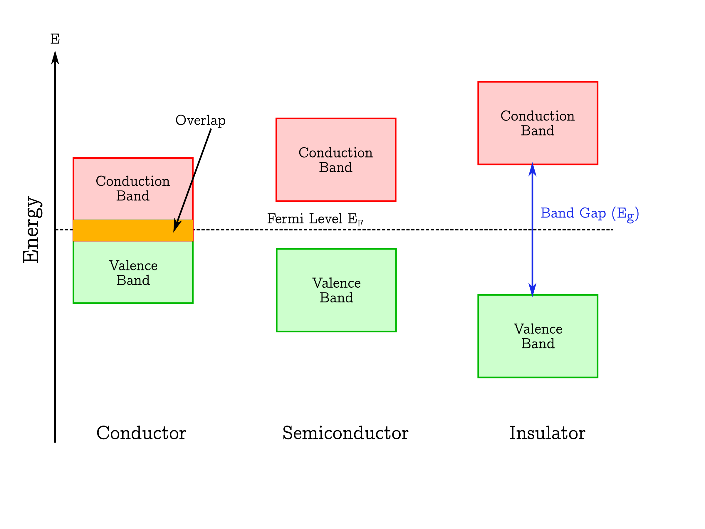

PEC
====

Introduction
------------

Solids are generally classified into three groups: *condcutors*, *semiconductors* and *insulators*.
Each category can be illustrated with a specific band structure as shown in figure :numref:`fig_band_structure`
:cite:p:`marucco2006`.

.. _fig_band_structure:

    Band Structure

